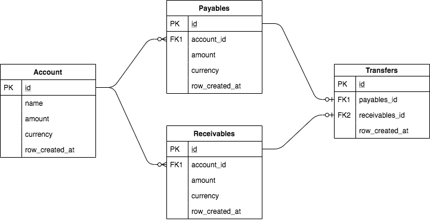

# Money Transfer REST API

The following project is a simple REST API for money transferring between accounts. The application is designed to be a standalone executable program that runs without any additional setup. The application supports creation and retrieval of user accounts. When creating an account, user selects currency in which money will be stored. Additionally, users are allowed to deposit, withdraw or transfer money between two accounts. It is possible to deposit or withdraw money from the user account in a different currency. It is also possible to transfer money between two accounts even if the accounts have different currencies.

## Assumptions
* The application is developed without use of heavy frameworks, such as Spring or Hibernate. A micro REST framework **Spark** was selected because of it's simplicity and support for both Java and Kotlin. The **Norm** was selected to reduce the ORM overhead and have a thin layer over JDBC instead.
* Money modifications happen synchronously for the sake of testing. In production version the communication would become asynchronous given the high rate of transaction operations. The endpoint would product a Kafka message to the topic, which would have a number of consumers for processing the message.
* All money related operations, including the currency conversion are performed by **moneta**. The currency conversion works only if the **ECB** provider or it's substitute is accessible over the network.
* Endpoints for listing the entities exists for testing purposes only. The production version would include pagination, filtering, etc.

## Requirements

### Technologies

* [Java 11](https://www.java.com/en/download/)
* [Maven 3](https://maven.apache.org/)

### Frameworks

* [Spark](http://sparkjava.com/)
* [Gson](https://github.com/google/gson)
* [Guice](https://github.com/google/guice)
* [Moneta](https://javamoney.github.io/)
* [H2](https://www.h2database.com/html/main.html)
* [Norm](https://github.com/dieselpoint/norm)
* [SLF4J](http://www.slf4j.org/)
* [JUnit 4](https://junit.org/junit4/)
* [Mockito](https://site.mockito.org/)

## Data Model
The data model is designed around two entities: **accounts** and **transactions**.

Accounts represent the user account in the system that can hold money in the pre-selected currency. Accounts are non-modifiable, except for the amount. The amount is always tight to the account currency.

Transactions can be split into three types: **payables**, **receivables** and **transfers**.

Paybles occur whenever the user **withdraws** the money from an account or sends the money to another account via **transfers**.

Receivables occur whenever the user **deposits** the money to an account or receives the money to another account via **transfers**.

Transfers occur only as a result of transferring money from one account to another. If the transfer is present, that means there is a corresponding payables and receivables operations from that transfer. 

All transactions are immutable and are used as events storage.

The following ERM diagram illustrates the entities and their relationships.



## REST API

[Postman Collection for Money Transfer REST API](docs/Money_Transfer_API.postman_collection.json)

[Swagger API Documentation](https://moneytransferapi2.docs.apiary.io/#)

### Account

| **Method** | **Path**          | **Intention**         |
| ---------- | ----------------- | --------------------- |
| POST       | /account          | Create an account     |
| GET        | /account          | List all accounts     |
| GET        | /account/:id      | Get account by id     |

### Transaction

| **Method** | **Path**                 | **Intention**                           |
| ---------- | ------------------------ | --------------------------------------- |
| POST       | /transaction/payables    | Withdraw the money from an account      |
| POST       | /transaction/receivables | Deposit the money to an account         |
| POST       | /transaction/transfers   | Transfer the money between two accounts |
| GET        | /transaction/payables    | List all payables                       |
| GET        | /transaction/receivables | List all receivables                    |
| GET        | /transaction/transfers   | List all transfers                      |

## Build

```shell script
mvn clean install
```

## Run

```shell script
java -jar target/moneytransfer-0.1-jar-with-dependencies.jar
```

The server is running on: http://localhost:4567/
